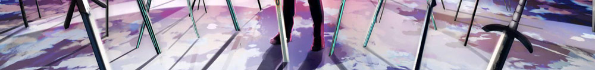

 

  

 

- [达达划词翻译](https://github.com/waynecz/dadda-translate-crx) @好看的划词翻译插件
- [vue-image-inputer](https://github.com/waynecz/vue-img-inputer) @优雅的图片输入框
- [Holmes](https://github.com/waynecz/Holmes) @开箱即用的 Koa 后端脚手架
- [Watson](https://github.com/waynecz/Watson) @实用的 Sass mixins，针对嵌套的 BEM 优化其写法
- [vue-component-boilerplate](https://github.com/waynecz/vue-component-boilerplate) @文档、构建、README 模板：一条龙式服务 Vue 组件的样板项目
- [UX-easy-guide](http://waynecz.github.io/ux-simple-guide) @简单的 Web 用户体验增强自查表 with shortest code

 
 

1.  [如果你也想写个完整的 Vue 组件项目](https://zhuanlan.zhihu.com/p/39012159)
2.  [SVG: 浪啊，浪来了，大浪来了](https://zhuanlan.zhihu.com/p/36031294)
3.  [SASS: 简单点，写 BEM 的方法简单点](https://zhuanlan.zhihu.com/p/28650879)
4.  [从 0 开始做一个的图片 / 文件选择（上传）组件[基础向]](https://segmentfault.com/a/1190000008503338)
5.  [小 Tips 让你的交互动画从 “还不错” 变成 “超级棒”](https://juejin.im/post/5abb712b518825556f557bfd)
6.  [页面内元素谁上谁下的体位总结](http://waynecz.github.io/2016/05/16/页面元素谁上谁下的体位总结/)
7.  [请问这 this 是那个？-- this 指向理清](http://waynecz.github.io/2016/05/11/简单的理解this/)
8.  [设计的几个关键原则](<http://waynecz.github.io/2016/05/05/(摘)%20设计的几个关键原则%20(一)/>)
9.  [CSS3 animation 动画的流程的简单控制](http://waynecz.github.io/2016/04/24/CSS3%20animation%20动画的流程控制)
10. [Express ＋ webpack + gulp ＋ nodemon 初级自动化](http://waynecz.github.io/2016/04/11/express＋webpack-gulp＋nodemon前端自动化/)
11. [流程控制：jQ Deferred 与 ES6 Promise 使用新手向入坑！](http://waynecz.github.io/2016/03/25/流程控制：%20jQ%20Deffered%20与%20ES6%20Promise%20使用入坑！/)
12. [从 git+add+commit+push 到 gamp!](http://waynecz.github.io/2016/03/06/从git-add-commit-push-到gamp/)
13. [Ajax 的懒人姿势](http://waynecz.github.io/2016/03/05/Ajax的懒人姿势/)
14. [CSS 动画优雅降级的简单总结](http://waynecz.github.io/2016/02/01/CSS动画优雅降级的简单总结/)
15. [自己几个常用的 CSS 片段](http://waynecz.github.io/2016/01/25/纪录几个CSS奇技淫巧/)
16. [一次网页访问各互联网协议实例](http://waynecz.github.io/2016/01/12/一次网页访问各互联网协议实例/)
17. [响应式设计下 img 标签如何设置才在移动端不下载图片](http://waynecz.github.io/2015/12/24/响应式设计下img标签如何设置才在移动端不下载图片/)

 
 

[全栈的安全小弟](http://gnaixx.cc/) ✈︎ [github](https://github.com/gnaixx) | [啥都会的烫神](https://blog.razord.top/) ☃︎ [github](https://github.com/Dreamacro) | 长者杨 ☁︎ [github](https://github.com/Leopoldthecoder)

 

